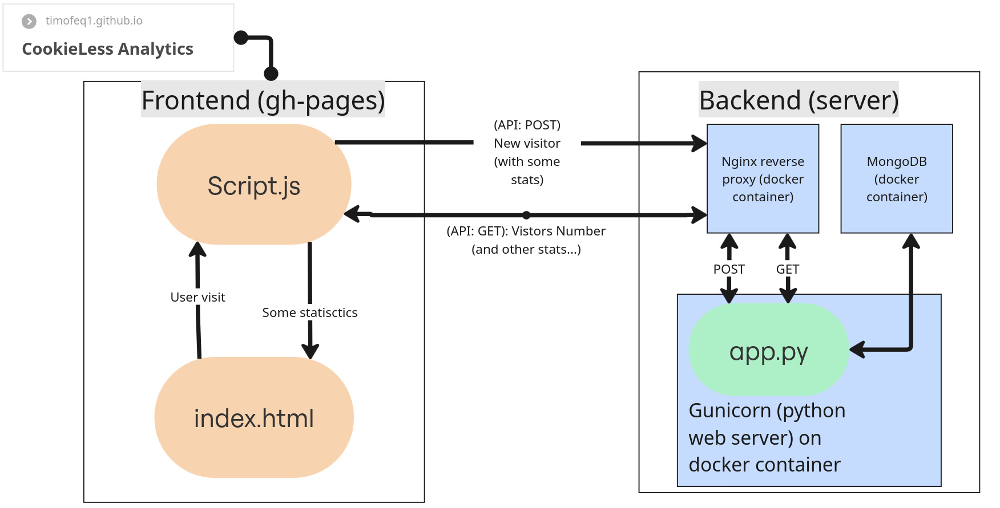

# 🍪 CookieLess 🔽
### System and Network Administration course project aimed at creating a service which collects and dispalys data about user without using cookie files
> [!NOTE]
> The project is currently in stage of active development, massive changes may occur
## Features
- Educational
- Open-Source 
- Backend containerisation
## Stack
Frontend:
- HTML, JavaScript, CSS

Backend:
- Python 3.11 🐍
- Docker, Docker Compose, Ansible
- Nginx
- MongoDB
## Project structure

## Coming soon
- [ ] Panels for statistics of current visitor (IP, Browser, RAM, etc.)
- [ ] CSS styling
- [ ] Github actions caused by git pushes
